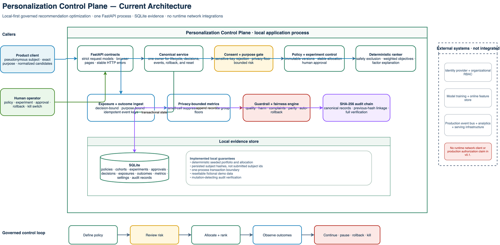
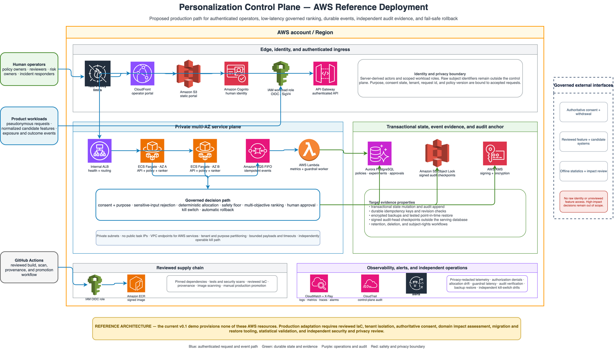

# Personalization Control Plane

[](https://github.com/hk-775/personalization-control-plane/actions/workflows/ci.yml)
[](LICENSE)
[](pyproject.toml)

**An open-source control plane for governed recommendation optimization and
experimentation.**

Personalization Control Plane gives product, data, risk, and engineering teams
one inspectable place to version recommendation policies, run bounded
experiments, allocate traffic deterministically, score candidates across
multiple objectives, link exposures to outcomes, enforce guardrails, require
human approval, roll back unsafe changes, and verify an audit trail.

The package is a fully seeded local product demo. It needs no credentials and
makes no external network calls at runtime. All organizations, people, cohorts,
products, events, and metrics are fictional.

[Project site](https://hk-775.github.io/personalization-control-plane/) ·
[Operator dashboard](https://hk-775.github.io/personalization-control-plane/dashboard.html) ·
[Architecture explorer](https://hk-775.github.io/personalization-control-plane/architecture.html) ·
[Quickstart](QUICKSTART.md) ·
[Startup guide](STARTUP.md) ·
[Ethics](docs/ETHICS.md)

## Run the seeded demo

Prerequisites: Python 3.11+ and `uv`.

```bash
./scripts/demo.sh
```

Open:

- Landing page: `http://127.0.0.1:8102`
- Operator dashboard: `http://127.0.0.1:8102/dashboard`
- Interactive architecture: `http://127.0.0.1:8102/architecture`
- OpenAPI: `http://127.0.0.1:8102/api/docs`

The first run installs the modest Python dependencies into a local `uv`
environment and creates `data/personalization-control-plane.db`. The database
is seeded automatically and can be restored at any time with the dashboard
button or `POST /api/v1/demo/reset`.

Docker is also supported:

```bash
docker compose up --build
```

See [QUICKSTART.md](QUICKSTART.md) for a guided first run.

## What is implemented

| Capability | Product behavior |
|---|---|
| Recommendation policies | Immutable active versions with exact purpose, allowlisted normalized features, objective weights, exploration, and candidate safety floor |
| Deterministic ranking | Stable SHA-256 allocation, bounded weighted multi-objective scoring, deterministic exploration and tie-breaking, factor-level explanations |
| Experiments | Create, review, approve, launch, pause, complete, roll back, or kill; global concurrent traffic cap |
| Traffic allocation | Stable control/treatment/holdout assignment with per-experiment and global caps |
| Event attribution | Idempotent exposure and outcome ingestion linked to an inspectable decision |
| Metrics | Experiment metrics with small-cohort value suppression |
| Guardrails | Quality floor, harm ceiling, complaint ceiling, and aggregate fairness-ratio floor |
| Human approval | Required for high traffic, high exploration, or material objective movement |
| Recovery | Automatic rollback on live guardrail failure and a global kill switch that pauses every running experiment |
| Audit | Canonical SHA-256 hash chain with verification endpoint |
| Demo | Fictional commerce, media, and community portfolio; reset and five guided scenarios |

## Safety and ethics are in the request path

This package deliberately treats personalization as a high-risk capability.
The following are executable controls, not prose-only recommendations:

- ranking without affirmative consent is refused;
- cohort, policy, exposure, and outcome purposes must match exactly;
- sensitive attributes and direct-identifier keys are rejected recursively;
- manipulative objectives such as compulsion, outrage, deceptive urgency, and
  time spent for its own sake are rejected from policy definitions;
- experiments below the minimum cohort size cannot advance toward launch;
- metric values below that floor are returned as `null` with a suppression
  reason;
- exploration is hard-capped, and higher exploration requires human approval;
- high-risk experiments remain `pending_approval` until a named reviewer acts;
- failed quality, harm, complaint, or fairness checks automatically roll back a
  running experiment;
- the kill switch serves approved baseline policies and never auto-resumes
  paused experiments;
- decisions include policy, assignment, objective contributions, exclusions,
  and explicit limitations;
- tests exercise every control above.

Read [docs/ETHICS.md](docs/ETHICS.md) before adapting the package.

## Example rank request

```bash
curl -sS http://127.0.0.1:8102/api/v1/recommendations/rank \
  -H 'Content-Type: application/json' \
  -d '{
    "request_id": "req-readme-001",
    "subject_id": "subject-readme-001",
    "domain": "commerce",
    "purpose": "help people find useful products they are likely to value",
    "consent": true,
    "cohort_id": "cohort-commerce-returning",
    "candidates": [
      {
        "id": "item-copper",
        "features": {
          "relevance": 0.91,
          "quality": 0.88,
          "user_value": 0.82,
          "diversity": 0.70,
          "freshness": 0.61,
          "satisfaction": 0.84,
          "safety": 0.99
        }
      }
    ]
  }'
```

The response contains:

- `decision_id` and deterministic `request_id`;
- policy id, version, and objective weights;
- experiment assignment and allocation bucket;
- ordered recommendations with base score, exploration adjustment, and every
  factor contribution;
- excluded candidates with the exact failed constraint;
- governance checks and limitations.

See [docs/API.md](docs/API.md) for the endpoint inventory and state contracts.

## Architecture



Editable source:
[current architecture draw.io](site/assets/system-architecture.drawio).

```text
Product client
    |
    v
FastAPI contracts
    |
    v
Consent + purpose + sensitive-input gate
    |
    +--> policy registry
    +--> experiment lifecycle + deterministic allocation
    +--> approval queue
    |
    v
Bounded multi-objective scorer
    |
    +--> inspectable decision
    +--> exposure -> outcome -> privacy-bounded metrics
                         |
                         v
                 guardrail / fairness engine
                         |
                 continue or auto-rollback
                         |
                         v
                 SHA-256 audit chain

SQLite stores policies, cohorts, experiments, approvals, decisions,
exposures, outcomes, metrics, settings, and audit records.
```

The implementation intentionally uses one service and SQLite so a reviewer can
trace behavior end to end. See [docs/ARCHITECTURE.md](docs/ARCHITECTURE.md).

### AWS reference deployment



Editable source:
[AWS reference draw.io](site/assets/aws-reference-architecture.drawio).

This is a proposed production path using AWS WAF, CloudFront, S3, Cognito,
IAM, API Gateway, an internal load balancer, ECS Fargate, SQS, Lambda, Aurora
PostgreSQL, KMS, ECR, CloudWatch, X-Ray, CloudTrail, and SNS. Version 0.1
provisions none of these resources.

## Repository map

```text
src/personalization_control_plane/
  app.py                 FastAPI routes and browser pages
  service.py             Canonical lifecycle and governance behavior
  engine.py              Deterministic allocation and scoring
  governance.py          Policy, risk, fairness, and guardrail checks
  storage.py             SQLite schema, seed, and audit chain
  seed.py                Fictional multi-domain portfolio
  web/                   Served landing, dashboard, and architecture pages
tests/                   Unit and API regression suite
site/                    Byte-for-byte publishable static mirror
docs/                    Architecture, ethics, API, demo, and deployment guides
scripts/                 Demo, test, smoke, and package-validation commands
```

## Test and validate

```bash
./scripts/test.sh
./scripts/smoke.sh
./scripts/validate.sh
```

`validate.sh` checks Python lint, the full tests, shell syntax, package hygiene,
the standard port, placeholder public URLs, and exact `site/` mirroring.

## Important limitations

This is a reference product and meeting-ready local demo—not a claim of
production safety, fairness, legal compliance, or business impact.

- It does not learn a model or independently verify candidate features.
- Weighted scoring is transparent but cannot establish causal benefit.
- Fairness ratio checks use opaque aggregate groups and are only one diagnostic.
- SQLite, one process, and same-store audit hashes are not a production
  availability or non-repudiation design.
- The local demo has no authentication, tenant isolation, or organizational RBAC.
- A real deployment needs threat modeling, privacy and accessibility review,
  domain-specific impact assessment, authenticated operators, durable event
  processing, external audit retention, observability, and incident rehearsal.

The complete boundary is in [docs/ETHICS.md](docs/ETHICS.md) and
[docs/DEPLOYMENT.md](docs/DEPLOYMENT.md).

Read [docs/PRODUCTION_READINESS.md](docs/PRODUCTION_READINESS.md) for the
readiness ledger and [docs/THREAT_MODEL.md](docs/THREAT_MODEL.md) for threats,
controls, assumptions, and residual risks.

## Publication artifacts

- [Evaluator startup](STARTUP.md)
- [Meeting demo](docs/DEMO.md)
- [Architecture reference](docs/ARCHITECTURE.md)
- [Production readiness](docs/PRODUCTION_READINESS.md)
- [Threat model](docs/THREAT_MODEL.md)
- [Publication inventory](docs/PUBLICATION_ARTIFACTS.md)
- [Launch materials](launch-materials.md)

## License

MIT No Attribution License (MIT-0). See [LICENSE](LICENSE).
