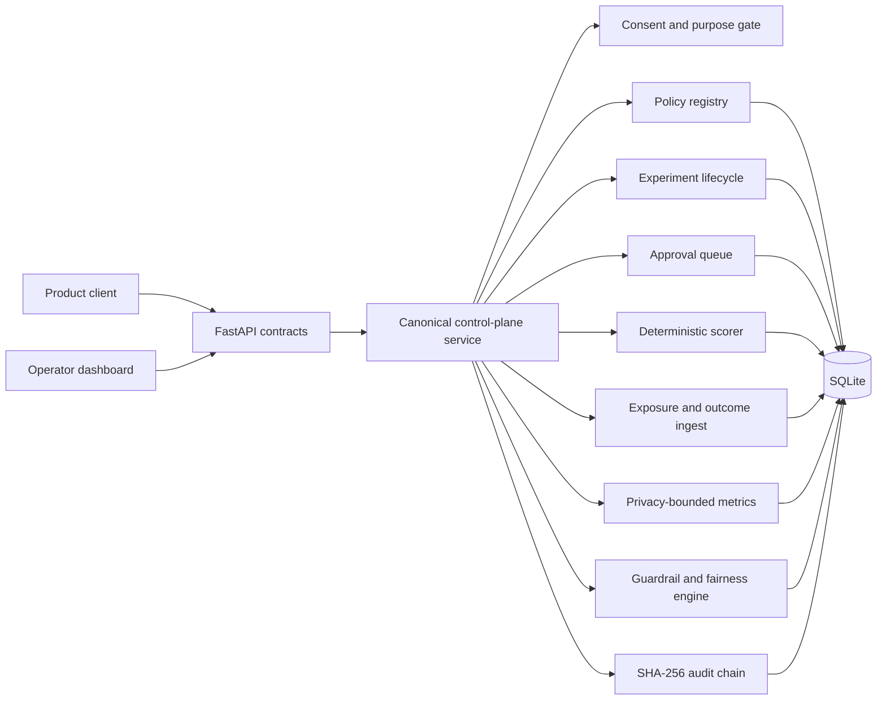
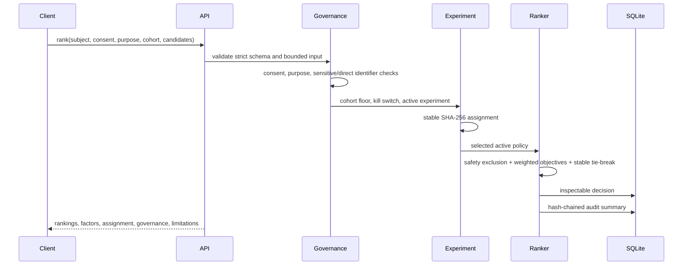

# Architecture

Current architecture:
[`../site/assets/system-architecture.png`](../site/assets/system-architecture.png)
([draw.io source](../site/assets/system-architecture.drawio)).

AWS reference deployment:
[`../site/assets/aws-reference-architecture.png`](../site/assets/aws-reference-architecture.png)
([draw.io source](../site/assets/aws-reference-architecture.drawio)).

## Product boundary

Personalization Control Plane is a local-first reference implementation of a
recommendation and experiment control plane. One FastAPI process owns:

- recommendation policy versions;
- experiment lifecycle and traffic allocation;
- deterministic candidate scoring and explanations;
- exposure and outcome records;
- privacy-bounded metrics;
- guardrail and fairness evaluation;
- human approval state;
- rollback and the global kill switch;
- hash-chained audit evidence;
- the landing page, dashboard, and architecture explorer.

SQLite is the canonical local store. There are no runtime network dependencies.


## AWS reference deployment


The AWS diagram is a future-state reference, not deployed infrastructure. It
maps the production-readiness gaps to authenticated human and workload ingress,
multi-AZ container serving, durable event processing, replicated transactional
state, externally anchored audit evidence, and privacy-redacted operations.
Authoritative consent, reviewed features, offline statistics, and impact review
remain governed external systems.

## Component map



## Recommendation path



The service stores only a SHA-256 subject hash, not the submitted subject id.
The decision fingerprint is also hashed before persistence.

## Experiment lifecycle

```text
draft -> review -> approved -> running -> completed
                    |           |  |
                    |           |  +-> paused -> running
                    |           |             -> rolled_back
                    |           +-----> rolled_back
                    |                  -> killed
                    |
                    + high risk -> pending_approval
                                      | approved -> approved
                                      + denied   -> review
```

Before review, approval, or launch the service re-checks:

- cohort size;
- exact domain and purpose alignment;
- active control and treatment policies;
- required guardrail thresholds;
- policy-risk classification;
- the global kill switch;
- global concurrent experiment traffic.

## Allocation

`deterministic_allocation` hashes:

```text
allocation-salt + experiment-id + pseudonymous subject-id
```

The first 64 digest bits map to a fraction in `[0, 1)`. The experiment traffic
percentage defines enrollment. `treatment_share` divides enrolled traffic
between treatment and control; all other traffic is holdout.

Assignment is deterministic for one experiment and subject. Changing the salt
would be a breaking allocation migration.

## Scoring

For each candidate:

```text
base_score = sum(feature[objective] * policy_weight[objective])
adjustment = stable_fraction(subject, request, candidate) centered around zero
final_score = clamp(base_score + exploration_rate * adjustment, 0, 1)
```

Candidates below `candidate_safety_floor` are excluded before ranking. Missing
objective features contribute zero. Unknown features are rejected rather than
ignored. The response exposes every feature value, policy weight, and
contribution.

This is transparent multi-objective optimization, not a learned model.

## Events and metrics

An exposure must reference:

- an existing decision;
- the same hashed subject;
- one of the returned candidate ids;
- the exact decision purpose.

An outcome must reference an existing exposure, use an allowlisted outcome
type, and preserve the purpose. Event ids are idempotency keys; reusing one with
different content fails.

Metric rows below the configured minimum cohort size return `value: null` and a
suppression reason.

## Guardrail response

The engine evaluates:

- `quality_score >= min_quality_score`;
- `harm_rate <= max_harm_rate`;
- `complaint_rate <= max_complaint_rate`;
- `fairness_ratio >= min_fairness_ratio`.

An eligible aggregate failure against a running experiment immediately changes
the experiment to `rolled_back`. Subsequent allocations cannot select it.

Fairness evaluation accepts only opaque aggregate group keys. Every group must
meet the same minimum cohort floor before any rate is returned.

## Audit chain

Each audit record hashes:

```text
SHA-256(previous_record_hash + ":" + canonical_json(current_record))
```

The first record uses `GENESIS`. `/api/v1/audit` recomputes the complete chain
and returns the first failed record if mutation is detected.

This detects local mutation. Production non-repudiation would require a
separate append-only or externally notarized evidence system.

## Static site

The application serves files from
`src/personalization_control_plane/web/`. `site/` contains an exact copy of:

- landing page;
- operator dashboard;
- architecture page;
- shared CSS and JavaScript;
- read-only fictional dashboard fallback data.

`scripts/validate_package.py` fails if any mirrored byte differs.
